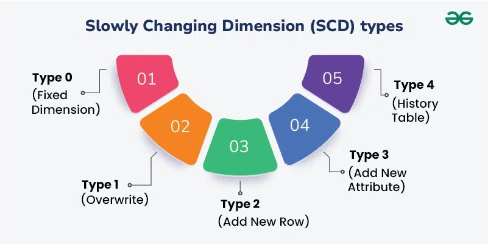
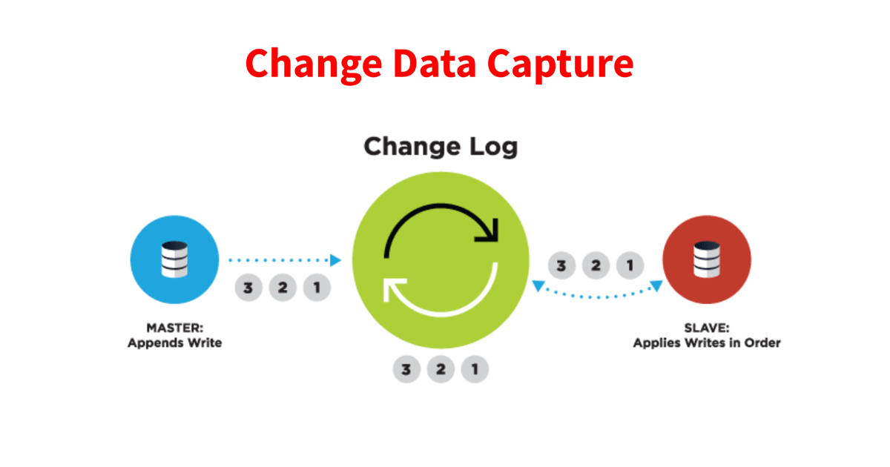
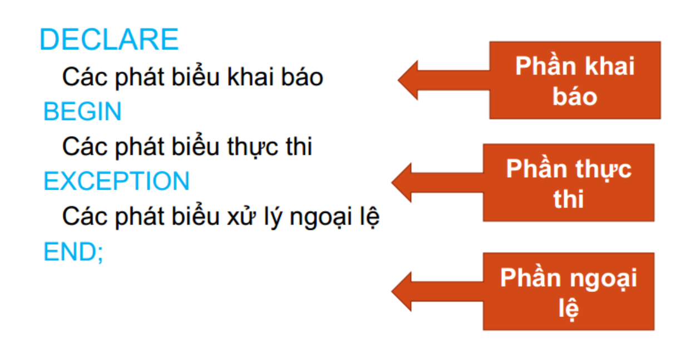

# Data Engineer Technique
## 📄 Mục lục
[0️⃣ Hướng dẫn chạy code Demo:](how_to_run_code.md)

[1️⃣ SCD (Slowly Changing Dimention):](#1️⃣-scd-slowly-changing-dimention)

[2️⃣ CDC (Change Data Capture):](#2️⃣-cdc-change-data-capture)

[3️⃣ Apache Iceberg:](#3️⃣-apache-iceberg)

[4️⃣ Build data pipeline:](#4️⃣-build-data-pipeline)

[5️⃣ SQL (Structured Query Language):](#5️⃣-sql-structured-query-language)

***

## 1️⃣ SCD (Slowly Changing Dimention):
### 📝 Khái niệm:
- SCD viết tắt cho Slowly Changing Dimension, là một kỹ thuật trong mô hình hóa dữ liệu, được sử dụng trong kho dữ liệu để xử lý các thay đổi theo thời gian trong các thuộc tính của dữ liệu. 



#### **Xem thêm lý thuyết về các loại SCD (nguyên lý hoạt động, ưu điểm và nhược điểm):** ***[Chi tiết các loại SCD](https://docs.google.com/document/d/1Y8w0AFGf5DL2vO3uhZEdpwIbg7wc5RlpXnPq2rq10Fs/edit?usp=sharing)***

### 📌 Source Code Demo các loại SCD: ***[SCD Demo Code](./SCD_demo)***
***

## 2️⃣ CDC (Change Data Capture):
#### ***(đang cập nhật)*** 
### 📝 Khái niệm:
- CDC là một quy trình để xác định và theo dõi các thay đổi của dữ liệu.



#### **Xem thêm lý thuyết về các loại CDC (nguyên lý hoạt động, ưu điểm và nhược điểm):** ***[Chi tiết các loại CDC](https://docs.google.com/document/d/1Y8w0AFGf5DL2vO3uhZEdpwIbg7wc5RlpXnPq2rq10Fs/edit?usp=sharing)***

### 📌 Source Code Demo các loại SCD: ***(đang cập nhật)*** ***[CDC Demo Code](./CDC_demo)***
***

## 3️⃣ Apache Iceberg:
### 📝 Khái niệm:
- Apache Iceberg là 1 định dạng bảng dữ liệu phân tán, giúp đơn giản hóa việc xử lý dữ liệu trên các tập dữ liệu lớn được lưu trữ trong các kho dữ liệu.
- Cấu trúc quản lý dữ liệu bảng Apache Iceberg:
```
Iceberg Table (Bảng Iceberg)
├── Catalog / Metastore (Danh mục / Kho siêu dữ liệu)
|   └── Trỏ đến Metadata File hiện tại (Current Metadata File Pointer)
|
├── Metadata Files (Các tệp Siêu dữ liệu) - Mỗi phiên bản bảng có một tệp
|   ├── Snapshot History (Lịch sử Ảnh chụp)
|   ├── Schema (Lược đồ)
|   ├── Partition Specification (Đặc tả Phân vùng)
|   └── Snapshot (Ảnh chụp) - Trạng thái của bảng tại một thời điểm
|       ├── Snapshot ID
|       ├── Manifest List (Danh sách Tệp Manifest) - Trỏ đến các Manifest File
|       |   ├── Manifest File (Tệp Manifest) - Chứa danh sách Data Files
|       |   |   ├── Data File Entry 1 (Mục Tệp Dữ liệu)
|       |   |   |   ├── File Path (Đường dẫn Tệp)
|       |   |   |   ├── File Format (Định dạng Tệp: Parquet, ORC, Avro)
|       |   |   |   └── Partition Data (Dữ liệu Phân vùng)
|       |   |   ├── Data File Entry 2
|       |   |   └── ...
|       |   └── Manifest File ...
|       └── Manifest List ...
|
└── Data Files (Các Tệp Dữ liệu) - Dữ liệu thực tế được lưu trữ
    ├── Partition A
    |   └── data_file_1.parquet
    |   └── data_file_2.orc
    └── Partition B
        └── data_file_3.parquet
        └── ...
```
- Lưu ý: Phần demo bên dưới Catalog Metadata được lưu vào schema mặc định (public) trong postgreSQL. Các Data Files và Metadata Files được lưu vào folder iceberg-warehouse
#### **Xem thêm lý thuyết về Iceberg (định nghĩa, cấu trúc quản lý của dữ liệu bảng Iceberg,...):** ***[Chi tiết lý thuyết về Apache IceBerg](https://docs.google.com/document/d/1Y8w0AFGf5DL2vO3uhZEdpwIbg7wc5RlpXnPq2rq10Fs/edit?usp=sharing)***
### 📌 Source Code Demo ứng dụng Apache Iceberg: ***(ứng dụng trong tầng cur và dmt của data pipeline demo)*** ***[Iceberg Demo Code](./data_pipeline_demo/)***
***

## 4️⃣ Build data pipeline:
### 📝 Khái niệm: 
- Luồng dữ liệu (Data Pipeline) là một hệ thống hoặc chuỗi các tiến trình tự động được thiết lập để di chuyển, chuyển đổi (transform) và tải (load) dữ liệu từ các hệ thống nguồn đến một kho lưu trữ đích (như Data Warehouse, Data Lake), nhằm mục đích chuẩn bị dữ liệu cho việc phân tích, báo cáo, và các ứng dụng Machine Learning.


### 🔎 Phân tích Các Layer (Layered Architecture)
| No | Layer Name | Main function |
| :--- | :--- | :--- |
| 1 | Raw data /Ingestion / Data Source | Nơi lưu trữ dữ liệu thô (raw data) |
| 2 | Staging/ Bronze Layer | Đẩy 1:1 từ nguồn (nguyên vẹn): Dữ liệu được tải về và lưu trữ chính xác như khi lấy từ nguồn (không thực hiện bất kỳ thay đổi nào). |
| 3 | Processing/ Silver Layer | Làm sạch, Chuẩn hóa, Transform: Xử lý giá trị NULL, loại bỏ trùng lặp, chuẩn hóa kiểu dữ liệu. Đồng thời thực hiện xử lý logic (transform) cho dữ liệu |
| 4 | Curated / Gold Layer | Chuyển đổi Hoàn toàn & Áp dụng Logic Nghiệp vụ: Liên kết các bảng, tính toán chỉ số, áp dụng SCD. |
| 5 | Data Mart | Dữ liệu được tổng hợp, xử lý cho từng nghiệp vụ cụ thể |

***Ở tầng Processing và tầng Curated đều thực hiện việc chuyển đổi (transform) vậy có sự khác nhau gì ở 2 tầng?***

**Trong thực tế các dự án mình đã làm qua thì ví dụ rằng ta muốn tổng hợp 1 bảng và bảng đó dữ liệu được union từ việc xử lý logic của 2 hay nhiều bảng khác, thì ở tầng Processing ta sẽ tiến hành xử lý logic cho từng phần nhỏ, sau đó tầng curated ta sẽ tiến hành Union các bảng đã được xử lý đó lại và thiết lập xử lý SCD (nếu cần) cho bảng để được bảng hoàn thiện ở tầng Curated**

### 📌 Source Code Demo thiết lập Data Pipeline (Phân làm 4 tầng: stg, prc, cur, dmt): ***[Data Pipeline Demo Code](./data_pipeline_demo)***
***

## 5️⃣ SQL (Structured Query Language):
### 📌 Source Code SQL Demo ***[SQL Demo](./sql_demo)***

### ⚙️ PL/SQL (Procedural Language/Structured Query Language)
- PL/SQL (Procedural Language/Structured Query Language) là một ngôn ngữ lập trình lập trình hướng thủ tục sử dụng cho Oracle SQL. Nó là một mở rộng của Oracle SQL.
- PL/SQL bao gồm các thành phần ngôn ngữ hướng thủ tục bao gồm điều kiện và vòng lặp. Nó cho phép khai báo hằng số và biến, thủ tục và các hàm, kiểu dữ liệu và biến của các kiểu dữ liệu, và các trigger. Nó có thể sử lý các ngoại lệ (lỗi tại thời gian chạy). Mảng cũng được hỗ trợ nâng cấp để sử dụng cho các tập hợp trong PL/SQL. Nó có thể tạo một đơn vị PL/SQL như thủ tục, hàm, package, kiểu dữ liệu, triggers, những thứ được lưu trữ trong database được tái sử dụng bởi các ứng dụng bất kỳ giao tiếp với ứng dụng Oracle.
- Có một số khái niệm cần phải nắm vững khi lập trình với PL/SQL:
    -  Mỗi lệnh SQL kềt thúc bằng dấu chấm phẩy (;)
    - Các lệnh thuộc "ngôn ngữ định nghĩa dữ liệu" (Data Definition Language - DDL) không được sử dụng trong PL/SQL
    - Lệnh SELECT... INTO trả về nhiều dòng có thể gây ra exception (> 1 dòng).
    - Lệnh SELECT ... INTO không trả về dòng nào có thể gây ra exception
    - Các lệnh thuộc "ngôn ngữ thao tác trên dữ liệu" (Data Manipulation Language - DML) có thể tác động trên nhiều dòng dữ liệu.
    - Sử dụng toán tử := để gán giá trị cho một biến.

- **Cú pháp**


### ⚙️ Functions
- PL/SQL Functions là một khối lệnh (nhóm các lệnh) được đặt tên, thực hiện 1 chức năng nào đó và trả về một giá trị.
- Hàm được lưu trữ trên Database. Việc sử dụng hàm có một số lợi ích như:
    -  Cho phép thực hiện các thao tác nghiệp vụ phức tạp
    - Việc phân tích và xử lý dữ liệu được thực hiện trên Server
    - Có thể gọi hàm ngay trong câu lệnh truy vấn SELECT

- **Cú pháp**

```bash
CREATE [OR REPLACE] FUNCTION function_name [(
parameter_1 data_type,
parameter_2 data_type,
parameter_N data_type]
RETURN return_data_type IS
--the declaration statements
BEGIN
-- the executable statements
return return_data_type;
EXCEPTION
-- the exception-handling statements
END;
```
### ⚙️ Stored Procedures
- Một thủ tục PL / SQL là một khối lệnh PL SQL được đặt tên thực hiện một nhiệm vụ cụ thể.
    - Thủ tục PL / SQL cho phép bạn đóng gói logic nghiệp vụ phức tạp và tái sử dụng nó trong cả lớp cơ sở dữ liệu và lớp ứng dụng. Khác với Function, thủ tục không trả về 1 giá trị trực tiếp.
    - Cũng giống như Function, thủ tục có thể được lưu giữ ngay trong database như một đối.
tượng của database

- **Cú pháp**

```bash
CREATE [OR REPLACE] PROCEDURE proc_name [(parameter mode datatype
[, parameterX mode datatypeX...])]
IS
[--declarations statements]
BEGIN
--executable statements( PL/SQL block)
[ EXCEPTION
---exception handlers]
END [proc_name];
```
### ⚙️ Packages
- Package là một tập hợp các kiểu dữ liệu, biến lưu giữ giá trị và các thủ tục, hàm có cùng một mối liên hệ với nhau, được gộp lại. Đặc điểm nổi bật nhất của package là khi một phần tử trong package được gọi thì toàn bộ nội dung của package sẽ được nạp vào trong hệ thống. Do đó, việc gọi tới các phần tử khác trong package sau này sẽ không phải mất thời gian nạp vào hệ thống nữa giúp nâng cao tốc độ thực hiện lệnh của toàn bộ hàm, thủ tục có trong package.
- Một package được cấu trúc làm hai phần:
    - Phần mô tả (specification) định nghĩa các giao tiếp có thể có của package với bên ngoài.
    - Phần thân (body) là các cài đặt cho các giao tiếp có trong phần mô tả ở trên.
- Trong cấu trúc của Package bao gồm 5 thành phần:
    - Public variable (biến công cộng): là biến mà các ứng dụng bên ngoài có thể tham chiếu tới được.
    - Public procedure (thủ tục công cộng): bao gồm các hàm, thủ tục của package có thểtriệu gọi từ các ứng dụng bên ngoài.
    - Private procedure (thủ tục riêng phần): là các hàm, thủ tục có trong package và chỉ có thể được triệu gọi bởi các hàm hay thủ tục khác trong package mà thôi.
    - Global variable (biến tổng thể): là biến được khai báo dùng trong toàn bộ package, ứng dụng bên ngoài tham chiếu được tới biến này .
    - Private variable (biến riêng phần): là biến được khai báo trong một hàm, thủ tục thuộc package.Nó chỉ có thể được tham chiếu đến trong bản thân hàm hay thủ tục đó.

- **Cú pháp**

```bash
-- Khai báo Package Spec:
CREATE [OR REPLACE] PACKAGE <package_name>
IS| AS
-- Khai báo các kiểu (sẽ được sử dụng công khai)
[definitions of public TYPES
,declarations of public variables, types, and objects
,declarations of exceptions
,pragmas
,declarations of cursors]
-- và các hàm thủ tục.
[headers of procedures and functions]
END <package_name>;
```
### ⚙️ Merge
- MERGE là câu lệnh dùng để kết hợp INSERT và UPDATE trong một bước. Nó so sánh dữ liệu giữa source và target dựa trên điều kiện join.

- **Cú pháp**

```bash
MERGE INTO target t
USING source s
ON (t.id = s.id)
WHEN MATCHED THEN
    UPDATE SET 
        t.col1 = s.col1,
        t.col2 = s.col2
WHEN NOT MATCHED THEN
    INSERT (id, col1, col2)
    VALUES (s.id, s.col1, s.col2);
```
### ⚙️ Sequence
- SEQUENCE là bộ sinh số tự tăng độc lập, không phụ thuộc bảng. Dùng để tạo khóa chính, ID tự động giống như auto-increment nhưng linh hoạt hơn.

- **Cú pháp**

```bash
# Tạo Sequence
CREATE SEQUENCE seq_customer
    START WITH 1
    INCREMENT BY 1;

# Dùng Sequence
INSERT INTO customer (customer_id, name)
VALUES (seq_customer.NEXTVAL, 'Nguyen Van A');

# Xem giá trị hiện tại
SELECT seq_customer.CURRVAL FROM dual;
```
### ⚙️ Event
- EVENT là job scheduler trong MySQL, cho phép tự động chạy SQL theo thời gian (giống cron job trong Linux).
- Mục đích sử dụng:
    - Chạy stored procedure theo lịch.
    - Tự động xóa log cũ.
    - Refresh bảng summary hàng ngày.
    - ETL không cần Airflow, Cron hay Task Scheduler.

- **Cú pháp**
```bash
# Bật Event Scheduler
SET GLOBAL event_scheduler = ON;

# Tạo event:
CREATE EVENT <ten_envent>
ON SCHEDULE EVERY 1 DAY # có thể thay đổi thời gian chạy Event
STARTS CURRENT_TIMESTAMP
DO
    CALL my_procedure() ; # Gọi procedure
```

### ⚙️ Recursive
- RECURSIVE CTE (Common Table Expression đệ quy) là một kỹ thuật trong SQL cho phép:
    - Một truy vấn gọi lại chính nó
    - Lặp lại cho đến khi đạt điều kiện dừng (stop condition)
    - Kết quả được kết hợp thành một bảng tạm
Nó hoạt động giống như ***đệ quy (recursion) trong lập trình.***
- 👉 Nhờ vậy, SQL có thể xử lý:
    - Sinh dãy số (generate series)
    - Quản lý cây phân cấp (hierarchical data)
    - Tìm các phần tử missing trong ID
    - Graph traversal (parent → child)
- Một RECURSIVE CTE gồm 2 phần:
    - Anchor Member : Câu truy vấn chạy đầu tiên (base case)
    - Recursive Member : Truy vấn gọi lại chính nó đến khi điều kiện dừng


- **Cú pháp**
```bash
WITH RECURSIVE cte_name AS (
    -- Anchor member (base row)
    SELECT <initial value>
    
    UNION ALL
    
    -- Recursive member (calls itself)
    SELECT <expression>
    FROM cte_name
    WHERE <stop condition>
)

SELECT * FROM cte_name;

# Ví dụ sinh dãy số từ 1 → 10
WITH RECURSIVE numbers AS (
    SELECT 1 AS n
    UNION ALL
    SELECT n + 1 FROM numbers WHERE n < 10
)
SELECT * FROM numbers;
```

