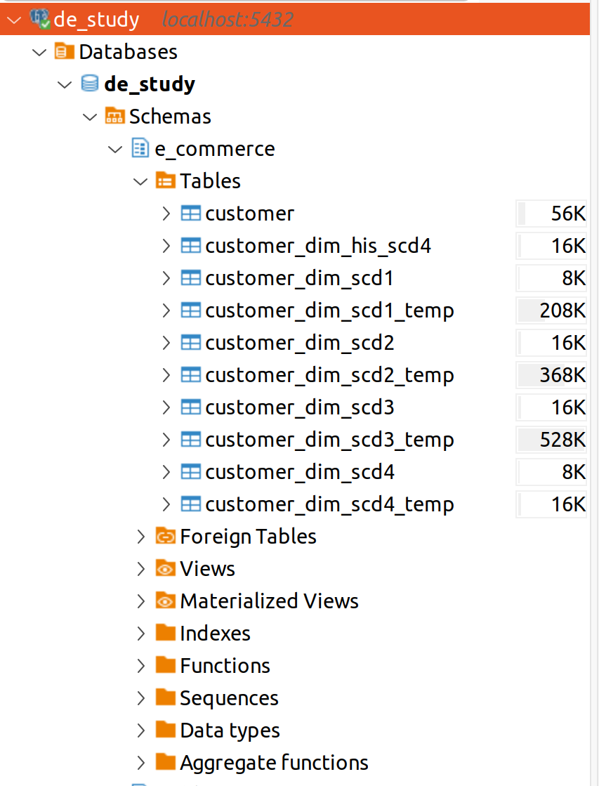

# Hướng dẫn cách chạy được code
### Bước 1: Cày đặt python (Khuyến nghị) tải phần mềm anaconda (sau đó vào vscode, chọn new terminal và bắt đầu tạo mội trường mới với python 3.10) (Ví dụ nhập lệnh vào terminal: conda create --name de_study python=3.10). Sau đó active môi trường mới tạo (nhập lệnh vào terminal: conda activate de_study), (hoặc có thể cày trên python trang chủ)
### Bước 2: Cài đặt spark (xem hướng dẫn trên youtube). Sau đó kiếm tải thêm 2 file ojdbc17.jar và postgresql-42.7.3.jar trên gg. Sau đó chuyển 2 file này vào folder spark/jars/
### Bước 3: Cài đặt pyspark (nhập lệnh vào terminal: pip install -r requirements.txt)
### Bước 4: Chạy file docker (nhập lệnh vào terminal: docker-compose up)
### Bước 5: Chạy file create_sample_table.py (Sau khi chạy có thể sử dụng tool DBeaver kết nối đến database để xem dữ liệu). Thông tin kết nối như ảnh: (username: mimhkhoi3104 / pass: 123) (có thể thay đổi thông tin user và pass trong file docker_compose)

### Bước 6: chạy các file SCD (nhập cú pháp vào terminal: python + tên đường dẫn file python + --etl_date + ngày). Ví dụ: python /home/minhkhoi/khoidata/Github/data_engineer_techniques/SCD_demo/SCD1.py --etl_date 20251130 (nếu không để etl_date thì sẽ lấy auto là today())
### Bước 7: chạy các câu lệnh DML trong file scd_test_case.sql trong DBeaver.
### Bước 8: Chạy lại các file SCD (đổi etl_date thành 1 ngày mới) sau đó vào BDeaver vào các table dim mới tạo để thấy được cách hoạt động của từng SCD.
